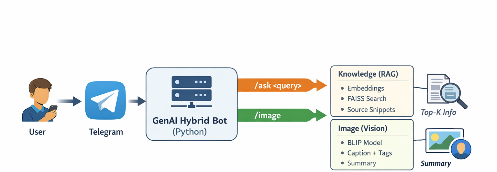

# GenAI Hybrid Telegram Bot (RAG + Vision)

-A lightweight GenAI Telegram Bot built in Python that supports:

- Mini-RAG (Retrieval-Augmented Generation) for answering questions from local documents

- Image captioning + tagging using an open-source vision model

- Optional enhancements like message history awareness, caching, source snippets, and summarization

# 🎥 Demo Video

Google Drive Link:
https://drive.google.com/file/d/12jpA0APEzdPWSb-jt3Ew1Ciw5bPgc652/view?usp=drive_link  

## 🏗️ Architecture Diagram



# 🚀 Features
✅ Commands Supported

- /help → Shows all commands

- /ask <query> → Answers questions using Mini-RAG from local docs

- /image → Upload an image → bot returns caption + 3 tags

- /summarize → Summarizes the last response (chat/image)

# 🧠 Mini-RAG Workflow (Text)

- Loads 3–5 Markdown documents from the data/ folder

- Splits documents into chunks

- Generates embeddings using sentence-transformers

- Stores vectors in FAISS

- Retrieves top-k relevant chunks for every query

Responds with:

- Answer
- Source snippets (doc name + chunk preview)

# 🖼️ Vision Workflow (Image)

- User sends /image
- Uploads an image
- Bot generates: first Caption and 2nd 3 tags/keywords

Sends results back to the user

# ⭐ Optional Enhancements Implemented

✅ Message history awareness (stores last 3 interactions per user)

✅ Basic caching (prevents re-embedding repeated queries)

✅ Source snippets shown in responses

✅ /summarize command (summarizes last bot response)

# 🛠️ Tech Stack

- Bot Framework: python-telegram-bot
- Embeddings: sentence-transformers (all-MiniLM-L6-v2)
- Vector Search: faiss-cpu
- Vision Model: BLIP (Salesforce/blip-image-captioning-base)
- Env Management: python-dotenv

# 📂 Project Structure
````
genai-telegram-rag-bot/
│── main.py
│── rag.py
│── vision.py
│── requirements.txt
│── README.md
│── .gitignore
│
├── assets/
│   └── architecture.png
│
├── data/
│   ├── doc1.md
│   ├── doc2.md
│   ├── doc3.md
│
├── Demo_screenshots/
│
│
└── temp_images/ (ignored)
````

# ⚙️ Setup Instructions (Run Locally)
## 1️⃣ Clone Repo
git clone <https://github.com/maheshyarroju/genai-hybrid-telegram-bot.git>
cd genai-telegram-rag-bot

## 2️⃣ Create Virtual Environment (Name: genai)
python -m venv genai

## 3️⃣ Activate Virtual Environment

- Windows
- genai\Scripts\activate
-Mac/Linux
- source genai/bin/activate

# 4️⃣ Install Requirements
pip install -r requirements.txt

# 5️⃣ Create .env File

Create a .env file in the root folder:

- TELEGRAM_BOT_TOKEN=your_token_here

# 6️⃣ Run the Bot
- python main.py

# 📌 Usage Examples
## Ask Questions
- /ask What is the WFH policy?

## Image Description
- /image

## Then upload an image.

### Summarize
- /summarize

# ⚠️ Notes

Do not upload .env or the genai/ environment folder to GitHub.

The temp_images/ folder is used only for runtime image downloads and should remain ignored.

# ✅ Deliverables Completed

- Source code (Python)
- README with setup instructions
- Mini-RAG system using local documents
- Vision-based image captioning
- Demo video

Optional enhancements (history, caching, sources, summarize)

# 👤 Author

Mahesh Kumar Yarroju
(Data Scientist / GenAI Developer)
